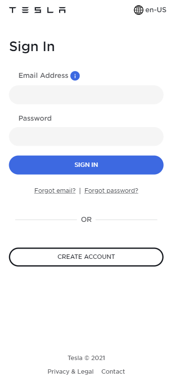

# Procesverslag
Markdown is een simpele manier om HTML te schrijven.  
Markdown cheat cheet: [Hulp bij het schrijven van Markdown](https://github.com/adam-p/markdown-here/wiki/Markdown-Cheatsheet).

Nb. De standaardstructuur en de spartaanse opmaak van de README.md zijn helemaal prima. Het gaat om de inhoud van je procesverslag. Besteedt de tijd voor pracht en praal aan je website.

Nb. Door *open* toe te voegen aan een *details* element kun je deze standaard open zetten. Fijn om dat steeds voor de relevante stuk(ken) te doen.

## Jij

uitwerken voor kick-off werkgroep

### Auteur:
Heba Ghozlan

#### Je startniveau:
Ik kan niet zo goed programmeren en vind ik nog steeds moeilijk, een simple website met html en css kan ik wel bouwen maar nog niet echt met javascript daarin verwerkt. 
Ik denk daarom dat ik bij de rode hoor.

#### Je focus:
Ik ga voor een surface plane een website maken omdat ik de layout van de website zo goed proberen na te maken in een device!

## Je website

uitwerken voor kick-off werkgroep

### Je opdracht:
Ik ga de website het tesla auto namaken omdat ik het ontwerp, kleuren en interactie ervan leuk vind. (link: tesla.com)

#### Screenshot(s) van de eerste pagina (small screen): 
Hier zie je de homepagina van de website  

#### Screenshot(s) van de tweede pagina (small screen):
Een inventaris pagina 

 

