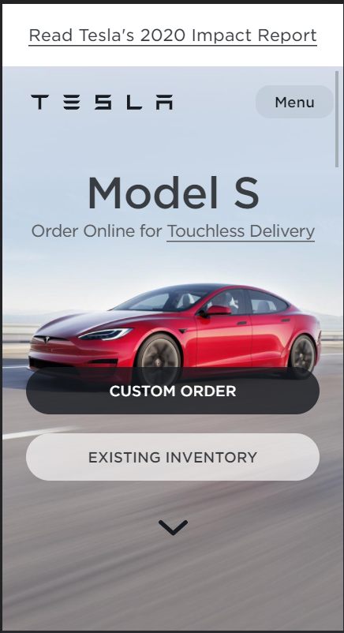

# Procesverslag
Markdown is een simpele manier om HTML te schrijven.  
Markdown cheat cheet: [Hulp bij het schrijven van Markdown](https://github.com/adam-p/markdown-here/wiki/Markdown-Cheatsheet).

Nb. De standaardstructuur en de spartaanse opmaak van de README.md zijn helemaal prima. Het gaat om de inhoud van je procesverslag. Besteedt de tijd voor pracht en praal aan je website.

Nb. Door *open* toe te voegen aan een *details* element kun je deze standaard open zetten. Fijn om dat steeds voor de relevante stuk(ken) te doen.

## Jij

uitwerken voor kick-off werkgroep

### Auteur:
Heba Ghozlan

#### Je startniveau:
Ik kan niet zo goed programmeren en vind ik nog steeds moeilijk, een simple website met html en css kan ik wel bouwen maar nog niet echt met javascript daarin verwerkt.
Ik denk daarom dat ik bij de rode hoor.

#### Je focus:
Ik ga voor een surface plane een website maken omdat ik de layout van de website zo goed proberen na te maken in een device!

## Je website

uitwerken voor kick-off werkgroep

### Je opdracht:
Ik ga de website het tesla auto namaken omdat ik het ontwerp, kleuren en interactie ervan leuk vind. (link: tesla.com)

#### Screenshot(s) van de eerste pagina (small screen):
Hier zie je de homepagina van de website  

#### Screenshot(s) van de tweede pagina (small screen):
Een account pagina

## Breakdownschets (week 1)

uitwerken na afloop 2e werkgroep

### de hele pagina:

### dynamisch deel (bijv menu):

## Voortgang 1 (week 2)

uitwerken voor 1e voortgang

### Stand van zaken
Positioneren vind ik nog steeds een beetje moeilijk en ik weet niet hoe ik beginnen moet om een hamburgermenutje te bouwen!

### Agenda voor meeting
samen met je groepje opstellen

| student 1      | student 2          |
| Maily          | Eva                |
|hoe moet je e-  |Javascript doet niet|
|en lange foto - |op github, hoe kan  |
|op github uplou-|dat opgelost worden!|
|den!            |                    |

### Verslag van meeting
hier na afloop snel de uitkomsten van de meeting vastleggen

- punt 1: Grote foto's zouden niet toonbaar zijn op github, daarom moet de foto kleiner worden, dat kan met photoshop!
- punt 2: Er waren wat errors bij javascript op github, Eva ging googlen hoe deze opgelost kunnen worden!
- punt 3: Ik had probleem met het positioneren van een paar items, het is opgelost door te weten wat ik neer moet zetten bij mijn parent en child items bijvoorbeel: (position: relative; <!!--voor container--> en position: absolute; <!!--voor items-->

## Voortgang 2 (week 3)

uitwerken voor 2e voortgang

### Stand van zaken
Ik wil mijn linkjes anders stijlen en ik heb geprobeerd om first-of-type, nth-of-type enz te gebruiken maar als ik het doe, alles gaat kapot!

### Agenda voor meeting
samen met je groepje opstellen

Voor dit gesprek had Maily de vraag van hoe ze elk regel tekst ander kleur kan geven.

### Verslag van meeting
hier na afloop snel de uitkomsten van de meeting vastleggen

- punt 1: Het eerste probleem kan opgelost worden met een span-tag voor het woord die je een ander kleur voor wilt geven.
- punt 2: Verder heb ik samen met de studentassistenten gekeken naar hoe ik de files op nette manier op github kan uploaden.
- punt 3: Omdat ik voor a-tag een position absolute heb gegeven en als ik elk a anders vormgeef, gaan ze eigenlijk op elkaar! Om dat te oplossen, moest ik twee keer voor ieder a positions-metingen van top, right en left op schrijven.

## Toegankelijkheidstest (week 4)

uitwerken na test in 8e voortgang

### Bevindingen
Lijst met je bevindingen die in de test naar voren kwamen:

#### Blur
Met een bril die de tekst blurry maakt, kon ik nog wel zien dat er tekst en fotos te zien is maar kan niet weten wat voor foto's en tekst die dan zijn. Niets is leesbaar en je weet niet waar je moet klikken.

Hierbij kunnen de buttons andere vorm hebben zodat de gebruiker met zulke beperking, kan weten dat hij erop kan klikken. Dat kan bijvoorbeeld door een grotere veelgekleurde buttons te maken!

#### Motoriek
Met die motorapparatje, kon ik nog steeds mijn website bediennen met een muis. Het ging wel moeilijker maar kon nog steeds doorheen scrollen en op een menu klikken!

Om makkelijker op het menu te klikken, kan ik de menu groter maken zodat misklikken op iets anders voorgekomen wordt, dat geldt ook voor alle menuitems; lijst van de navigatie!

#### Contrast
Met een bril die het kleuren van je website verandert, kon ik alles nog goed zien en weten waar ik op moet klikken en waar ik iets moet opschrijven!

Het gebruik van donkere kleuren op een lichte achtergrond en het omgekeerd daarvan, helpt mensen om dingen duidelijk te lezen!

#### Screenreader
Mijn website werd helemaal goed voorgelezen. Het begon met mijn h1 (logo die een img-tag heeft) naar de navigatie dan de sections en eindgt bij footer.

Voor mensen die wel kunnen zien en een screenreader moeten gebruiken, moet ik een focus state hebben voor interactie elemneten, zodat ze met een tap-key door mijn website kunnen maar ook kunnen ze weten wat ze de screenreader gaat voorlezen!

## Voortgang 3 (week 4)

uitwerken voor 3e voortgang

### Stand van zaken
Over de tap-key

### Agenda voor meeting
samen met je groepje opstellen

| student 1      | student 2          | student 3    | student 4        |
| ---            | ---                | ---          | ---              |
| dit bespreken  | en dit             | en ik dit    | en dan ik dat    |
| en dat ook nog | dit als er tijd is | nog een punt | dit wil ik zeker |
| ...            | ...                | ...          | ...              |

### Verslag van meeting
hier na afloop snel de uitkomsten van de meeting vastleggen

- punt 1
- punt 2
- nog een punt
- ...

