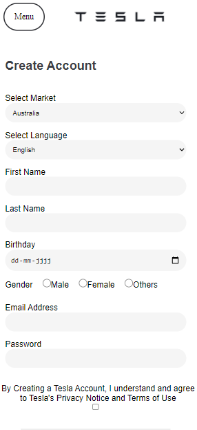

# Procesverslag
Markdown is een simpele manier om HTML te schrijven.  
Markdown cheat cheet: [Hulp bij het schrijven van Markdown](https://github.com/adam-p/markdown-here/wiki/Markdown-Cheatsheet).

Nb. De standaardstructuur en de spartaanse opmaak van de README.md zijn helemaal prima. Het gaat om de inhoud van je procesverslag. Besteedt de tijd voor pracht en praal aan je website.

Nb. Door *open* toe te voegen aan een *details* element kun je deze standaard open zetten. Fijn om dat steeds voor de relevante stuk(ken) te doen.

## Jij

uitwerken voor kick-off werkgroep

### Auteur:
Heba Ghozlan

#### Je startniveau:
Ik kan niet zo goed programmeren en vind ik nog steeds moeilijk, een simple website met html en css kan ik wel bouwen maar nog niet echt met javascript daarin verwerkt.
Ik denk daarom dat ik bij de rode hoor.

#### Je focus:
Ik ga voor een surface plane een website maken, omdat ik nieuwe dingen wil proberen te maken bijvoorbeeld feel animaties ofz.

## Je website

uitwerken voor kick-off werkgroep

### Je opdracht:
<a= href= "https://www.tesla.com">

Ik ga de website het tesla namaken omdat ik het ontwerp, kleuren en interactie ervan leuk vind.

#### Screenshot(s) van de eerste pagina (small screen):
Hier zie je de homepagina van de website  

#### Screenshot(s) van de tweede pagina (small screen):
Een account pagina

## Breakdownschets (week 1)

uitwerken na afloop 2e werkgroep

### de hele pagina:
Home

### dynamisch deel (bijv menu):
Zoom

## Voortgang 1 (week 2)

uitwerken voor 1e voortgang

### Stand van zaken
Ik vond dat de lessen een beetje te snel gaan maar nog steeds kan ik wel dingen begrijpen door oefeningen te doen, maar positioneren vind ik nog steeds een beetje moeilijk. Verder weet ik niet hoe te beginnen aan een hamburgermenutje!

### Agenda voor meeting
samen met je groepje opstellen

student 1 (Maily): hoe moet je een lange foto op github uploaden?
student 2 (Eva): Javascript doet niet op github, hoe kan dat opgelost worden?

### Verslag van meeting
hier na afloop snel de uitkomsten van de meeting vastleggen

- punt 1: Grote foto's zouden niet toonbaar zijn op github, daarom moet de foto kleiner worden, dat kan met photoshop!
- punt 2: Er waren wat errors bij javascript op github, Eva ging googlen hoe deze opgelost kunnen worden!
- punt 3: Ik had probleem met het positioneren van een paar items, het is opgelost door te weten wat ik neer moet zetten bij mijn parent en child items bijvoorbeel: (position: relative; <!!--voor container--> en position: absolute; <!!--voor items-->
- punt 4: Voor een hamburgermeun met navigatie erin, heb je 3 regels javascript nodig waarbij je een eventlistener toevoegt voor een toggle om die te laten tonen of juist verbergen.

## Voortgang 2 (week 3)

uitwerken voor 2e voortgang

### Stand van zaken
Ik wil mijn linkjes anders stijlen en ik heb geprobeerd om first-of-type, nth-of-type enz te gebruiken maar als ik het doe, alles gaat kapot!

### Agenda voor meeting
samen met je groepje opstellen

Voor dit gesprek had Maily de vraag van hoe ze elk regel tekst ander kleur kan geven.

### Verslag van meeting
hier na afloop snel de uitkomsten van de meeting vastleggen

- punt 1: Het eerste probleem (Maily's punt) kan opgelost worden met een span-tag voor het woord die je een ander kleur voor wilt geven.
- punt 2: Verder heb ik samen met de studentassistenten gekeken naar hoe ik de files op nette manier op github kan uploaden.
- punt 3: Omdat ik voor a-tag een position absolute heb gegeven en als ik elk a anders vormgeef, gaan ze eigenlijk op elkaar! Om dat op te oplossen, moest ik twee keer voor ieder a positions-metingen van top, right en left op schrijven.
- punt 4: Eva heeft laten zien hoe ze een animatie van haar site heeft gedaan. De animatie was erom een vlag die verschijnt voor een stukje text als je erop hovert. Om dat te doen heeft ze de img van de vlag normaal een opacity van 0 gegeven en als je erop hovert, gaat het langzaam verschijnen naar opacity van 20% en met z-index van 10 bij de text erop wordt het nog steeds leesbaar!

## Toegankelijkheidstest (week 4)

uitwerken na test in 8e voortgang

### Bevindingen
Lijst met je bevindingen die in de test naar voren kwamen:

#### Blur
Met een bril die de tekst blurry maakt, kon ik nog wel zien dat er tekst en fotos staan, maar kan niet weten wat voor foto's en tekst die dan zijn. Niets is leesbaar en je weet niet waar je moet klikken.

Hierbij kunnen de buttons andere vorm hebben zodat de gebruiker met zulke beperking, kan weten dat hij erop kan klikken. Dat kan bijvoorbeeld door een grotere veelgekleurde buttons te maken!

#### Motoriek
Met die motorapparatje, kon ik nog steeds mijn website bediennen met een muis. Het ging wel moeilijker maar kon nog steeds doorheen scrollen en op een menu klikken!

Om makkelijker op het menu te klikken, kan ik de menu groter maken zodat misklikken voorgekomen wordt (kleine button = meer keren klikken totdat je doel bereikt is!), dat geldt ook voor alle menuitems; lijst van de navigatie!

#### Contrast
Met een bril die het kleuren van je website verandert, kon ik alles nog goed zien en weten waar ik op moet klikken en waar ik iets moet opschrijven!

Het gebruik van donkere kleuren op een lichte achtergrond en het omgekeerd daarvan, helpt mensen om dingen duidelijk te lezen!

#### Screenreader
Mijn website werd helemaal goed voorgelezen. Het begon met mijn h1 (logo die een img-tag heeft) naar de navigatie dan de sections en eindgt bij footer.

Voor mensen die wel kunnen zien en een screenreader moeten gebruiken, moet ik een focus state hebben voor interactie elemneten, zodat ze met een tap-key door mijn website heen kunnen.
Ook is het irritant om steeds navigatie voor te lezen als je lange navigatie lijst hebt, daarom heb ik skip to content link toegepast!

## Voortgang 3 (week 4)

uitwerken voor 3e voortgang

### Stand van zaken
Ik heb gevraagd over de tap-key en hoe moet ik door alle linkjes heen kunnen tappen zonder herf!

### Agenda voor meeting
samen met je groepje opstellen

student 1 (Maily): Is het voldoende dat de site op 1 mobile scherm werkt voor de surface plane?
student 2 (Eva): Alt tekst bij images, hoe uitgebreid die moeten en hoe je dat het beste aan kunt pakken? / hoe groot/klein het scherm moet kunnen zijn om de volle punten voor responsiveness te pakken?

### Verslag van meeting
hier na afloop snel de uitkomsten van de meeting vastleggen

- punt 1: Om door alle linkjes heen te kunnen tappen MOET een herft staan, anders is het gewone tekst.
- punt 2: Als je voor surface plane kiest, hoef je geen responsive site te gaan bowen, alleen meer micro-details uit te werken bijvoorbeeld animaties!
- punt 3: Alt text kun je met een woord beschrijven, het hoeft geen lange tekst te zijn. soms ook wel beter als je hem helemaal leeg laat voor images die niets met de content te maken hebben.
- punt 4: Het kun van een heel klein scherm tot een dashboard scherm, van een iphone 5 die niet zo veel mensen nu gebrukite tot een grote projecterscreen!

## Herkansing (21 Januari 2022)

uitwerken voor herkansing eindgesprek

### Stand van zaken
Aan het eind, alles ging goed maar ik moest bijna huilen voor een functie die niet meer werkte omdat ik bij css commentaar heb extra / toegevoegd!

Ik heb een leuk plaatje toegevoegd als je meer dan 390px je scherm vergroot, ik heb het zelf gedaan en ben trots erop!

Ik heb een paar functies toegevoegd zoals een inputveld die invisible is maar als je erop een radiobutton klikt, komt hij te zien.

### Screenshot(s)

hier screenshot(s) van je eindresultaat

## Bronnenlijst

continu bijhouden terwijl je werkt

1. bron 1: Site<a= href= "https://tesla.com">
2. bron 2: Hamburger Menu<a= href= "https://codepen.io/shooft/pen/zYzEPgv?editors=0110">
3. bron 3: Scroll Animatie <a= herf= "https://codepen.io/SamSloot/pen/MWEYwOB">
4. bron 4: Light Theme Inspiratie <a= herf= "https://codepen.io/shooft/pen/qBjKYjJ">

